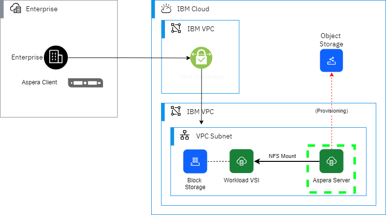
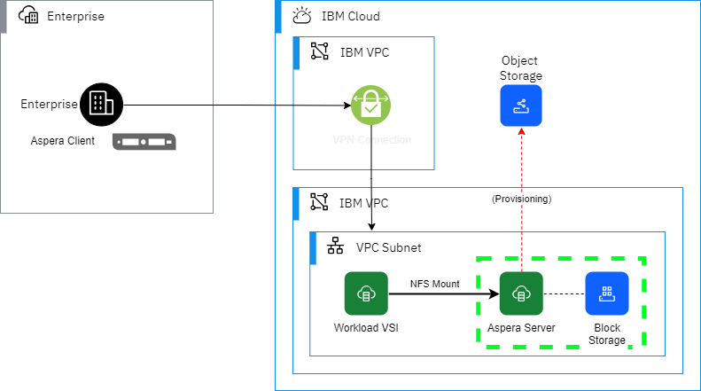
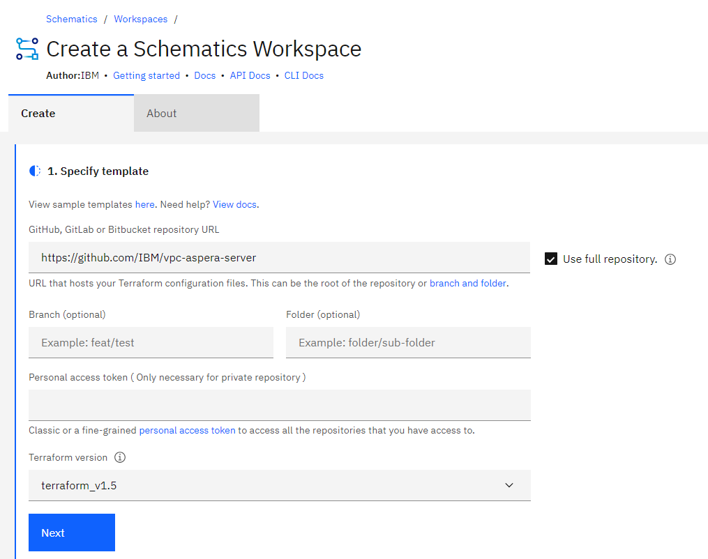
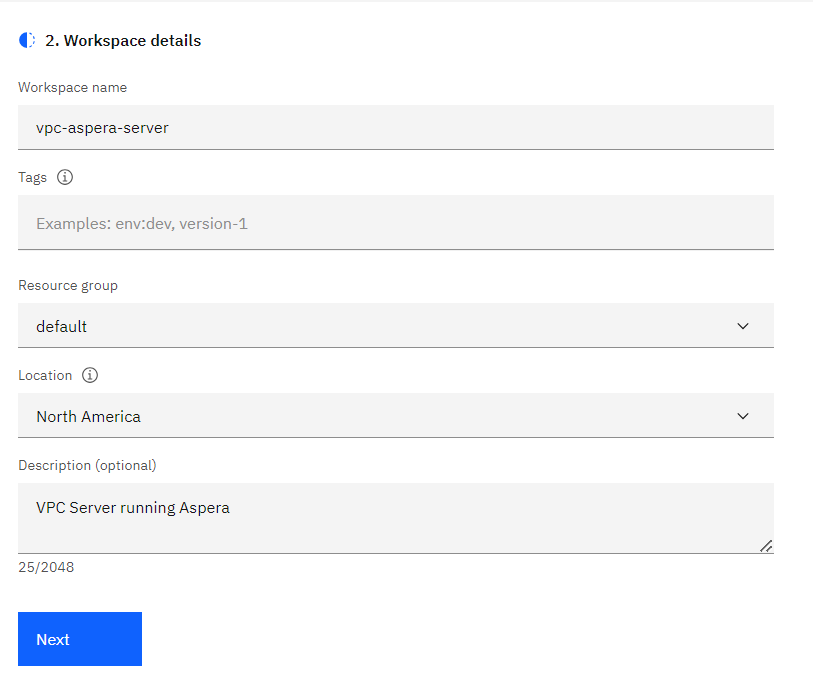
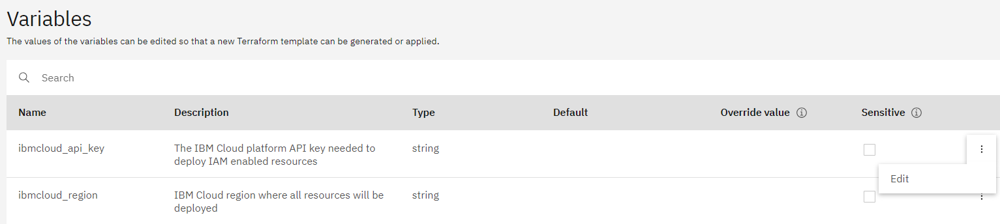

# VPC Aspera Server

## Overview

This module allows a user to easily create a VPC Virtual Server running an Aspera server. Aspera
is a data transport and streaming technology that provides high-speed data transfer service. The
VPC Virtual Server will be connected by the automation with either an existing NFS share, an
existing VPC file share, or an attached block storage where the data uploaded will be stored.

This Terraform module deploys the following infrastructure:

- Virtual Server
- IBM API Key*
- VPC Block Storage**

|||
|---|---|
| * | The API key is only needed for setup. It is deleted once complete. |
| ** | A block storage device is created when using [attached storage](#attached-storage-export-volume). |

## Compatibility

This module includes bash shell scripts that are run during the Terraform apply. These are written
to work with most Linux distributions. You may also use this module with
[IBM Schematics](#ibm-schematics).

### Deployment Model

The Aspera Server (green box) is created by this automation. The other components show an example of
how it might be accessed by onsite infrastructure.

A VPN connection can be made as shown in the diagram by following the steps here for a
[site-to-site VPN](https://cloud.ibm.com/docs/vpc?topic=vpc-vpn-create-gateway&interface=ui) or a
[client-to-site server](https://cloud.ibm.com/docs/vpc?topic=vpc-vpn-create-server&interface=ui).

#### Attached Storage (Export Volume)

You may also choose to create the Aspera server with attached block storage instead of connecting to
a remote NFS share. Use the variables that begin with `export_volume_` to define this behavior. The
only required variable to set to enable this is `export_volume_size` (greater than 10). This will
tell the automation how large (in GB) to allocate for Aspera's storage. The automation will create a
volume, then partition and format it. The volume will be exported via NFS and you can then mount it
remotely with another host in the VPC network. The diagram below shows an example of how this could
be used. Note, you may not use attached storage and also mount a remote NFS share. When enabled the
output variable `aspera_nfs_mount` will be the local network endpoint for this volume.

The block storage volume created is named using the `export_volume_name`. When the automation is
destroyed, this volume will persist. This is to protect the data from being deleted after the
Aspera server is no longer needed. If you wish to delete this volume, visit the VPC block storage
portal. If this automation is re-applied and the volume exists, it will be reused.

You may also have advanced use cases for the data volume. You may choose to create the volume ahead
of deployment and specify that existing volume as the `export_volume_name`. In this case, you will
need to supply either an empty volume or a volume with a single ext4 partition with the label
`aspera-data`. Any other configuration will fail to mount the volume. You may also wish to write
data to one volume and then create or attach a new volume. You can do this by changing the
`export_volume_name` variable and re-applying the automation. This could be useful if you are
wishing to populate multiple volumes and then attach to workload servers later.

#### Static IP Address

If you are planning to reuse the Aspera server with different configurations, you may wish to use a
static IP address with it. This can be done by specifying the variable `vpc_ip_address`. It must be
an available IP address in the subnet you define with the variable `vpc_subnet_name`. This can be
useful when populating many block storage devices, preventing a need to change to the client
configuration with each one. Otherwise, a random IP assignment from the network will be made with
each apply.

## Setup Requirements

### Prerequisites

#### Upgrading your IBM Cloud Account

To order and use IBM Cloud services, billing information is required for your account. See
[Upgrading Your Account](https://cloud.ibm.com/docs/account?topic=account-upgrading-account).

#### Install Terraform

If you wish to run Terraform locally, see
[Install Terraform](https://learn.hashicorp.com/tutorials/terraform/install-cli#install-terraform).

#### IBM Cloud API Key

You must supply an IBM Cloud API key so that Terraform can connect to the IBM Cloud Terraform
provider. See
[Create API Key](https://cloud.ibm.com/docs/account?topic=account-userapikey&interface=ui#create_user_key).

#### Aspera Binary Download

You can download the Apsera binaries needed for the server and client software from the
[IBM Aspera Download](https://www.ibm.com/products/aspera/downloads) page.

#### Install Files

Before running this automation you must upload the Aspera binary and your license file to a Cloud
Object Store bucket. See
[Getting started with Cloud Object Storage](https://cloud.ibm.com/docs/cloud-object-storage?topic=cloud-object-storage-getting-started-cloud-object-storage)
or [Create Object Storage](https://cloud.ibm.com/objectstorage/create).

- Aspera Binary: Linux RPM binary, you will need the linux-64 version. This should have a file name
that starts with `ibm-aspera-hsts` and ends with `linux-64-release.rpm`.
- Aspera License: This will be an encoded file with the extension `aspera-license`.

#### VPC Subnet

Before deploying, you will need to have created a landing zone for the Aspera server. This could be
a network in an existing VPC or a new one you create. The volumes Aspera will write to
must be in the VPC you ultimately wish to use them. These can be the volumes that Aspera
creates or via NFS shares from other machines on the same network.

#### NFS Export or VPC File Share

Optionally, the Aspera server created by this automation can write data to an existing NFS share in
the same network (subnet). If chosen, before deploying this automation, you will first need to
create that NFS export for the data destination. You will supply the NFS mount string in the format
`<IP>:<shared directory>` to this automation's variable `nfs_mount_string`. This is not compatible
with creating attached storage for the Aspera server.

VPC file shares behave similarly, using the same variable to enable the automation to write data to
the VPC file share. For more information see [VPC File Shares](https://cloud.ibm.com/docs/vpc?topic=vpc-file-storage-create&interfaceaui)

#### Connectivity

The Aspera server created by this automation will be connected to the private network you specify
with the variable `vpc_subnet_name`. This will allow it to connect with VPC servers on that
network.

### Deployment

#### Terraform CLI

You may choose to use the Terraform command line to deploy this module. You can download terraform here:
[Install Terraform](https://developer.hashicorp.com/terraform/install). Once installed, run
`terraform init` and then `terraform apply` to create the Aspera server. When you run apply,
terraform will prompt you for the required variables.

If you need to specify any of the optional variables, you can do so by exporting the variable using
the prefix `TF_VAR_`, using a `.tfvars` file, or by passing them as an option to the terraform
command using `-var`. For more information see
[Assigning Values to Root Module Variables](https://developer.hashicorp.com/terraform/language/values/variables#assigning-values-to-root-module-variables).

#### IBM Schematics

Schematics is an IBM Cloud service, that delivers Infrastructure as Code (IaC) tools as a service.
You can use the capabilities of Schematics to consistently deploy and manage your cloud
infrastructure environments. From a single pane of glass, you can run end-to-end automation to build
one or more stacks of cloud resources, manage their lifecycle, manage changes in their
configurations, deploy your app workloads, and perform day-2 operations.

To create an Aspera Server with Schematics,
first [create a workspace](https://cloud.ibm.com/schematics/workspaces/create). Specify this
repository for the repository URL and set the Terraform version to 1.5 or greater. Click Next, and
then give the workspace a name and any other details you'd like. You may choose to use any Resource
Group or Location.

| Specify Template | Workspace Details |
|---|---|
|||

Once your Workspace is created. Use the Variables section below the Details section on the Settings
page to configure Aspera. You will need to edit and specify every variable that has a description
not starting with "Optional variable". If needed also specify any variables that are optional.

After setting the variables, you may use the "Apply plan" button at the top of the page to deploy.

#### Wait for Deployment

Once the automation is applied, you will need to wait for the VPC server to boot and the install
scripts to complete. This may take up to 5-10 minutes.

### Post Deployment

#### Aspera Connection

This automation has two [output](#outputs) variables that will be shown once completed. The
`aspera_endpoint` will be the private network IP address of the Aspera server. You will need to have
completed the [connectivity](#connectivity) step in order to access this. Use your Aspera client to
create a new connection to this endpoint. For the credentials you must give the username `root` and
supply the private key matching the `ssh_key_name` key pair you specified previously.

#### NFS Export (Attached Storage)

If you've chosen to create the Aspera server with attached storage, you can access this by mounting
the [output](#outputs) variable `aspera_nfs_mount` from another server in the same network. This
will only be accessible while the Aspera server is running.

## Variable Behavior

There are a number of variables defined in variables.tf used by this Terraform module to deploy and
configure your infrastructure. See [Inputs](#inputs) for full list of variables with their
descriptions, defaults, and conditions.

## Support

If you have problems or questions when using the underlying IBM Cloud infrastructure, you can get
help by searching for information or by asking questions through one of the forums. You can also
create a case in the
[IBM Cloud console](https://cloud.ibm.com/unifiedsupport/supportcenter).

For information about opening an IBM support ticket, see
[Contacting support](https://cloud.ibm.com/docs/get-support?topic=get-support-using-avatar).

To report bugs or make feature requests regarding this Terraform module, please create an issue in
this repository.

## References

- [What is Terraform](https://www.terraform.io/intro)
- [IBM Cloud provider Terraform getting started](https://cloud.ibm.com/docs/ibm-cloud-provider-for-terraform?topic=ibm-cloud-provider-for-terraform-getting-started)
- [IBM Cloud VPC VPN Gateway](https://cloud.ibm.com/docs/vpc?topic=vpc-using-vpn)
- [IBM Aspera](https://www.ibm.com/products/aspera)

<!-- BEGINNING OF PRE-COMMIT-TERRAFORM DOCS HOOK -->
## Requirements

| Name | Version |
|------|---------|
|  [terraform](#requirement\_terraform) | >= 1.5.0 |
|  [ibm](#requirement\_ibm) | 1.66.0 |

## Modules

No modules.

## Resources

| Name | Type |
|------|------|
| [ibm_iam_api_key.temp](https://registry.terraform.io/providers/IBM-Cloud/ibm/1.66.0/docs/resources/iam_api_key) | resource |
| [ibm_is_instance.aspera](https://registry.terraform.io/providers/IBM-Cloud/ibm/1.66.0/docs/resources/is_instance) | resource |
| [ibm_is_instance_template.existing_volume](https://registry.terraform.io/providers/IBM-Cloud/ibm/1.66.0/docs/resources/is_instance_template) | resource |
| [ibm_is_instance_template.new_volume](https://registry.terraform.io/providers/IBM-Cloud/ibm/1.66.0/docs/resources/is_instance_template) | resource |
| [ibm_is_instance_template.nfs_volume](https://registry.terraform.io/providers/IBM-Cloud/ibm/1.66.0/docs/resources/is_instance_template) | resource |
| [ibm_is_image.aspera](https://registry.terraform.io/providers/IBM-Cloud/ibm/1.66.0/docs/data-sources/is_image) | data source |
| [ibm_is_security_groups.vpc](https://registry.terraform.io/providers/IBM-Cloud/ibm/1.66.0/docs/data-sources/is_security_groups) | data source |
| [ibm_is_ssh_key.aspera](https://registry.terraform.io/providers/IBM-Cloud/ibm/1.66.0/docs/data-sources/is_ssh_key) | data source |
| [ibm_is_subnet.aspera](https://registry.terraform.io/providers/IBM-Cloud/ibm/1.66.0/docs/data-sources/is_subnet) | data source |
| [ibm_is_volumes.existing](https://registry.terraform.io/providers/IBM-Cloud/ibm/1.66.0/docs/data-sources/is_volumes) | data source |

## Inputs

| Name | Description | Type | Default | Required |
|------|-------------|------|---------|:--------:|
|  [aspera\_base\_image\_name](#input\_aspera\_base\_image\_name) | Debug variable to specify the base OS for the Aspera server. This Aspera server automation has been tested with CentOS 9 Stream (VPC version 7). Use this variable if you wish to try another version. | `string` | `"ibm-centos-stream-9-amd64-7"` | no |
|  [cos\_bucket\_name](#input\_cos\_bucket\_name) | COS bucket that contains the Aspera installer and license file. | `string` | n/a | yes |
|  [cos\_region](#input\_cos\_region) | Optional variable to specify the region the COS bucket resides in.  Available regions are: jp-osa, jp-tok, eu-de, eu-gb, ca-tor, us-south, us-east, and br-sao. Please see [Regions](https://cloud.ibm.com/docs/overview?topic=overview-locations) for an updated list.  If not specified, the region corresponding to the `ibmcloud_region` will be used. | `string` | `""` | no |
|  [export\_volume\_directory](#input\_export\_volume\_directory) | Optional variable for directory used for export volume. Must be absolute. | `string` | `"/aspera"` | no |
|  [export\_volume\_name](#input\_export\_volume\_name) | Optional variable for name for volume created to export. | `string` | `"aspera"` | no |
|  [export\_volume\_profile](#input\_export\_volume\_profile) | Optional variable for the type of disk for volume created to export. Supported values are `general-purpose`, `5iops-tier`, `10iops-tier`." | `string` | `"general-purpose"` | no |
|  [export\_volume\_size](#input\_export\_volume\_size) | Either `nfs_mount_string` or `export_volume_size` MUST be specified.  Size of disk in GB for volume created to export. If specified, the disk size must be between 10 and 16000 GB. When greater than 0, Aspera will use this as the destination instead of the `nfs_mount_string`. When equal to 0, volume is not created and Aspera will use `nfs_mount_string` as its destination. The export volume will be exported as an NFS share. | `number` | `0` | no |
|  [ibmcloud\_api\_key](#input\_ibmcloud\_api\_key) | The IBM Cloud platform API key needed to deploy IAM enabled resources | `string` | n/a | yes |
|  [ibmcloud\_region](#input\_ibmcloud\_region) | IBM Cloud region where all resources will be deployed | `string` | n/a | yes |
|  [name](#input\_name) | The name used for the Aspera server. Other resources created will use this for their basename and be suffixed by a random identifier. | `string` | n/a | yes |
|  [nfs\_mount\_string](#input\_nfs\_mount\_string) | Either `nfs_mount_string` or `export_volume_size` MUST be specified.  This will specify the NFS mount string in the format `<IP>:<shared directory>` Used for the Aspera destination. | `string` | `""` | no |
|  [ssh\_key\_name](#input\_ssh\_key\_name) | SSH key for the Aspera Server. This key must exist in the VPC. It is used for root SSH access as well as the Aspera connection. | `string` | n/a | yes |
|  [vpc\_instance\_profile](#input\_vpc\_instance\_profile) | Optional variable to set instance cores and memory by VSI Profile. | `string` | `"bx2-2x8"` | no |
|  [vpc\_ip\_address](#input\_vpc\_ip\_address) | Optional variable to statically set the private network IP address for the Aspera server. The default behavior is to randomly assign an IP from the `vpc_subnet_name` network. | `string` | `""` | no |
|  [vpc\_security\_groups](#input\_vpc\_security\_groups) | Optional security groups for the Aspera VSI. The default security group for the VPC `vpc_subnet_name` is in will be used otherwise. | `list(string)` | `[]` | no |
|  [vpc\_subnet\_name](#input\_vpc\_subnet\_name) | Existing VPC network subnet name the Aspera server will be attached to. | `string` | n/a | yes |

## Outputs

| Name | Description |
|------|-------------|
|  [aspera\_endpoint](#output\_aspera\_endpoint) | Aspera server endpoint for data transfer. |
|  [aspera\_nfs\_mount](#output\_aspera\_nfs\_mount) | Mount point for exported volume. |
<!-- END OF PRE-COMMIT-TERRAFORM DOCS HOOK -->
